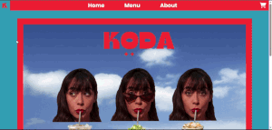
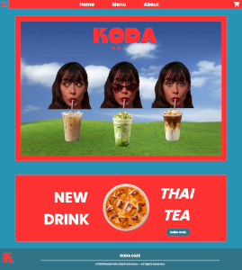
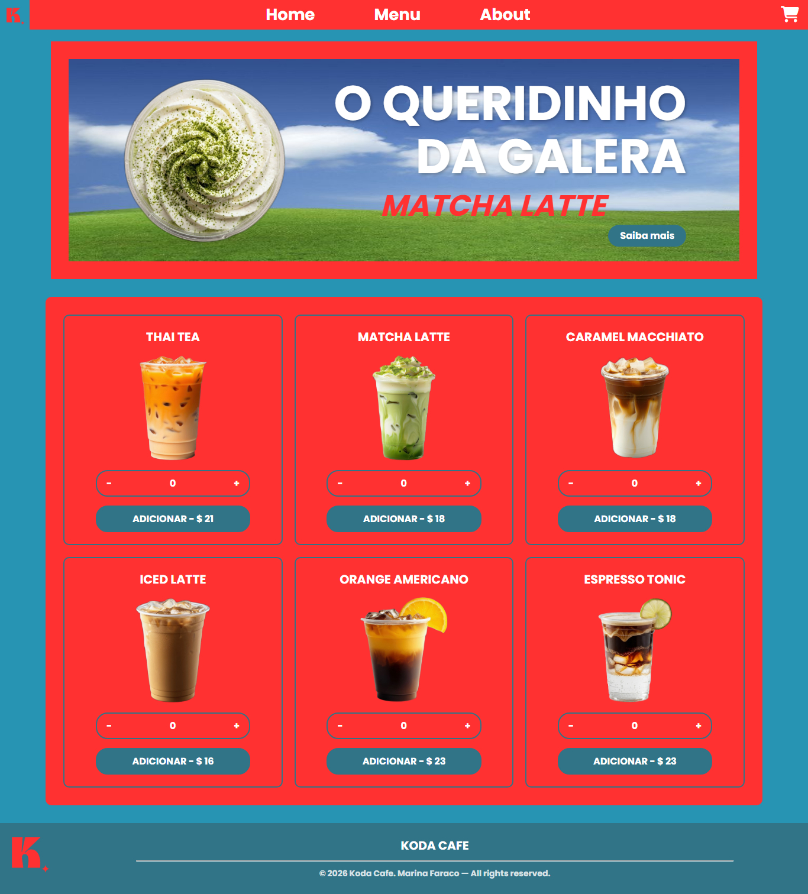
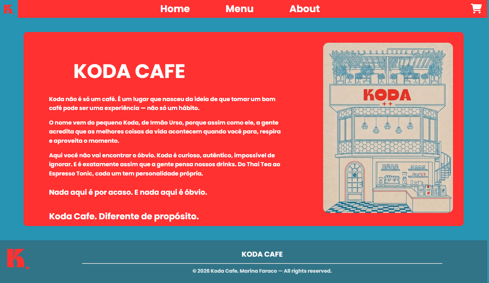

☕ KODA CAFE — Website

Site fictício de cafeteria desenvolvido como projeto de portfólio, com foco em front-end moderno, experiência do usuário e design responsivo.



## 📋 Sobre o Projeto

O KODA CAFE é um site para uma cafeteria fictícia criado com o objetivo de demonstrar habilidades em desenvolvimento front-end. O projeto contempla desde a apresentação visual da marca até um fluxo funcional de pedidos com carrinho, seleção de entrega, geolocalização de lojas próximas e formas de pagamento — simulando uma experiência real de e-commerce para o setor de alimentação.

O design de todas as páginas foi prototipado no Figma antes da implementação, garantindo consistência visual e um processo de desenvolvimento mais organizado e profissional.

## 🚀 Funcionalidades

### 🏠 Home Page (`index.html`)
- Seção de pedidos mais populares
- Seção de novidades do cardápio



### 📖 Menu (`menu.html`)
- Seção de pedido favorito
- Listagem completa de todos os produtos
- Exibição de preços e descrição de cada item
- Organização por categorias



### 🏠 About (`about.html`)
- Apresentação da marca KODA CAFE



### 🛒 Carrinho e Checkout
- Ícone de carrinho acessível em todas as páginas
- Seleção entre retirada no local ou delivery
- No delivery: geolocalização automática de lojas próximas via API Nominatim (OpenStreetMap)
- Campo para informar o endereço de entrega
- Escolha da forma de pagamento
- Resumo do pedido antes da finalização
- Geração de QR code simbólico ao final do checkout — um toque extra de polimento que reforça a experiência de e-commerce real, mantendo a transparência de que se trata de um projeto conceitual

<!-- 📸: screenshot ou GIF -->

## 🛠️ Tecnologias Utilizadas

| Tecnologia | Finalidade |
|---|---|
| HTML5 | Estrutura e semântica das páginas |
| CSS3 | Estilização, layout responsivo e animações |
| JavaScript | Interatividade, lógica do carrinho e manipulação do DOM |
| API Nominatim (OpenStreetMap) | Geolocalização de lojas próximas |
| Figma | Prototipagem e design das interfaces |

## 🎨 Design

O layout foi inteiramente projetado no Figma, passando pelas etapas de wireframe e protótipo de alta fidelidade antes da codificação. Isso permitiu validar a experiência do usuário e a identidade visual da marca antes de qualquer linha de código.

🔗 [Acessar protótipo no Figma](#)

<!-- 📸 screenshot do protótipo -->

## 📁 Estrutura de Arquivos

```
koda-cafe/
│
├── assets/
│
├── docs/
│   └── images/
│       ├── capa.png
│       ├── home.jpg
│       ├── menu.jpg
│       ├── about.jpg
│       └── cart.jpg
│
├── index.html          # Home page
├── menu.html           # Cardápio
├── about.html          # Sobre a cafeteria
├── cart.html           # Carrinho
├── style.css           # Estilo
├── README.md
```

## 💡 O que este projeto demonstra

- Estruturação semântica com HTML5
- Criação de layouts responsivos com CSS
- Manipulação do DOM com JavaScript puro
- Gerenciamento de estado do carrinho sem frameworks
- Integração com API externa de geolocalização (Nominatim)
- Componentização mental de UI antes de usar frameworks
- Processo profissional de design com Figma antes do desenvolvimento
- Foco em UX: fluxo claro de pedido, opções de entrega e pagamento

## 📌 Status do Projeto

✅ Concluído

- [x] Design no Figma
- [x] Estrutura HTML das páginas
- [x] Estilização CSS
- [x] Lógica do carrinho com JavaScript
- [x] Geolocalização de lojas via API Nominatim
- [x] Fluxo de checkout (retirada / delivery)
- [x] Responsividade mobile

## 👤 Autora

Feito por **Marina Faraco**

[LinkedIn](#) · [GitHub](#)

---

*Este projeto foi desenvolvido exclusivamente para fins de portfólio. A cafeteria KODA CAFE é fictícia.*